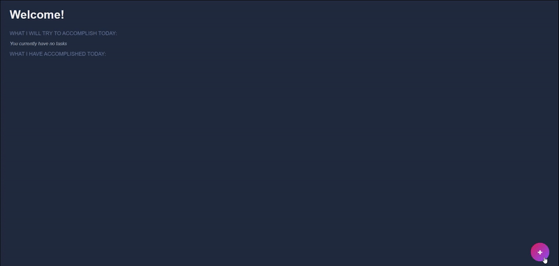

# Seize The Day

> A to-do app with your mental health in mind. 

<!--  -->

## Features

### Welcome page
- User authentication supported using JSON Web Tokens and password encryption using Bcrypt password-hashing

### Home page
- Custom greeting based on username
- Randomly generated affirmations and reminders to help redirect thoughts and attitudes into positive directions 
- Create items to add to your to-do list
- Click on an item to mark it complete and it will move to your accomplishment list
- Click on the 'X' to delete items

## Built With

- MongoDB, Mongoose.js
- Node.js, Express.js
- JSON Web Tokens
- React.js, Material UI, Vite
- HTML5/CSS3, Javascript ES6
- ESbuild, ESlint, Stylelint
- VSCode

## Get your own copy running!
### Backend
In one terminal:
1. Change the directory to the config folder and create a new file
  ```sh 
  cd api/config
  touch .env
  ```
2. Create .env variables PORT and DB_STRING
  ```sh
  PORT = 2222 // port 2222 is used as the api_base in App.js on the client side
  DB_STRING = "<Replace everything in quotes with MongoDB Connection String>"
  ```
3. Navigate back to the api
  ```sh
  cd ...
  ```
4. Install packages and dependencies
  ```sh
  npm i
  ```
 
*The server will be running on localhost:2222*

### Frontend
In a second terminal:
1. Navigate to the client folder
  ```sh
  cd client
  ```
2. Install packages and dependencies
  ```sh
  npm i
  ```
 
### Start the app
Concurrently is a package that allows you run multiple commands in a single terminal
To run the application in a development server,
1. Navigate to the client folder
2. In the client folder, the package.json should have a "script" that looks like this:
  ```sh
  "api": "cd ../api && npm start",
  ```
3. While still in the client folder, run the application using this command:
  ```sh
  concurrently "npm:api" "npm:dev"
  ```

*The client side application will render on localhost:4444* <br />
*The page will reload if you make edits.*<br />

## Roadmap

- [X] Mobile-first design; responsiveness using CSS Flexbox and Grid (but needs to be redesigned for an improved UI/UX)
- [X] Utilize Material UI for consistent, reusable components
- [ ] A task can become a list when subtasks are added
  - For example, a task with the title "Grocery Shopping" can become a list if subtasks, such as grocery items, are added
- [ ] Organize tasks using tags, such as important or critical, or users can create custom tag names

See the [open issues](https://github.com/alexisintech/seize-the-day/issues) for a full list of proposed features (and known issues).
