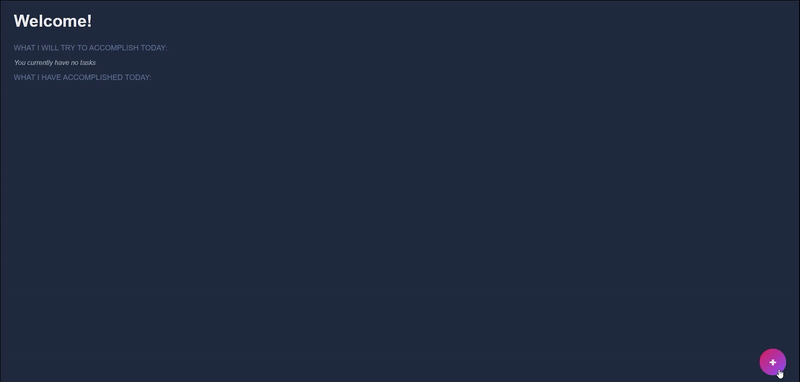

# To-Do App

> To-Do full-stack CRUD application built with MongoDB, Express, Nodejs, and React.

## Features

- Create items to add to your to-do list
- Click on an item to mark it complete and it will move to your accomplishment list
- Click on the 'X' to delete items

## Built With

- MongoDB, Mongoose.js
- Node.js, Express.js
- React.js, Webpack, Babel
- HTML5/CSS3, Javascript ES6
- ESlint, Stylelint
- VSCode

## Get your own copy running!

### Clone this repo using your preferred method 
### Backend
In one terminal:
- `cd api/config` (change directory to config folder)
- `touch .env` (create a new file in the config folder)
- Create .env variables PORT and DB_STRING:
  - `PORT = 2222` (port 2222 is used as the api_base in App.js on the client side)
  - `DB_STRING = <mongoDB connection string>`
- `cd ../` (change directory back to /api)
- `npm i`
- `npm start` 

The server will be running on localhost:2222

### Frontend
In a second terminal:
- `cd client`
- `npm i` 
- `npm start` 

The client side application will render on localhost:3000  
The page will reload if you make edits. 
You will also see any lint errors in the console.
